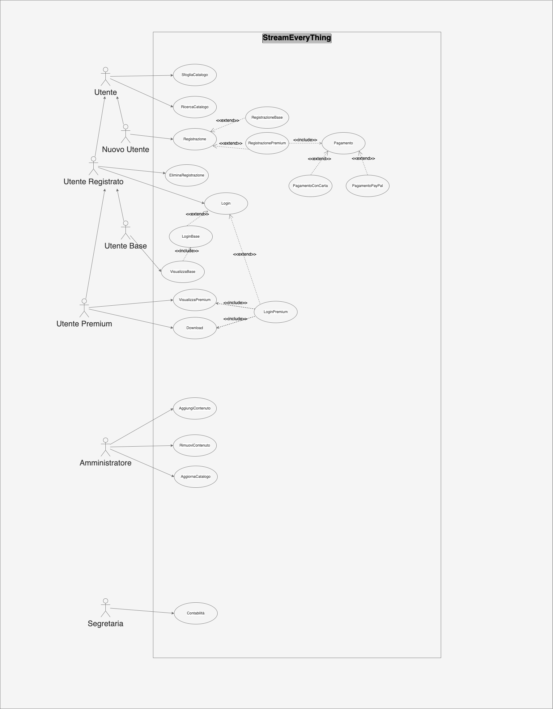

# Caso d’uso: Registrazione
**ID**: 1  
**Breve descrizione**: L’utente si registra alla piattaforma fornendo i propri dati e sceglie il tipo di registrazione.  
**Attori primari**: Utente  
**Attori secondari**: Nessuno  
**Precondizioni**: Nessuna  
**Sequenza degli eventi principale**:  
1. L’utente seleziona la funzionalità “Registrazione”.  
2. La piattaforma chiede all’utente di compilare tre campi (nome, cognome, email).  
3. L’utente inserisce i dati richiesti.  
4. La piattaforma chiede all’utente di selezionare il tipo di registrazione (base o premium).  
5. SE l’utente seleziona l’opzione di registrazione premium:  
   5.1 La piattaforma fornisce i due metodi di pagamento possibili (carta di credito o PayPal).  
   5.2 L’utente inserisce i dati della carta di credito (o i dati del suo account PayPal).  
   5.3 FINTANTOCHÉ i dati inseriti non sono validi:  
      5.3.1 La piattaforma chiede di inserire una carta di credito valida (o un account PayPal valido).  
      5.3.2 L’utente inserisce i dati richiesti.  
      5.3.3 La piattaforma verifica i dati inseriti.  
6. La piattaforma crea un nuovo account per l’utente.  
**Postcondizioni**: Un nuovo account è stato creato.  
**Sequenza degli eventi alternativa**:  
- RegistrazioneGoogle  
- RegistrazioneFacebook  
- EmailNonValida  

---

# Caso d’uso: RicercaCatalogo
**ID**: 3  
**Breve descrizione**: L’utente cerca nel catalogo della piattaforma un contenuto.  
**Attore primario**: Utente  
**Attore secondario**: Nessuno  
**Precondizioni**: Nessuna  
**Sequenza degli eventi principale**:  
1. L’utente seleziona la funzionalità “RicercaCatalogo”.  
2. La piattaforma chiede all’utente i criteri di ricerca.  
3. L’utente inserisce i criteri di ricerca e conferma.  
4. La piattaforma ricerca i film o serie TV che corrispondono ai criteri di ricerca immessi dal cliente.  
5. SE la piattaforma trova uno o più risultati:  
   5.1 PER ogni risultato trovato:  
      5.1.1 La piattaforma mostra l’immagine del risultato.  
      5.1.2 La piattaforma mostra il nome del risultato.  
6. ALTRIMENTI:  
   6.1 La piattaforma restituisce un errore che corrisponde all’assenza del contenuto desiderato nel proprio catalogo.  
**Postcondizioni**: Il film o la serie TV ricercata dall’utente viene restituita.  
**Sequenza degli eventi alternativa**: Nessuna  
